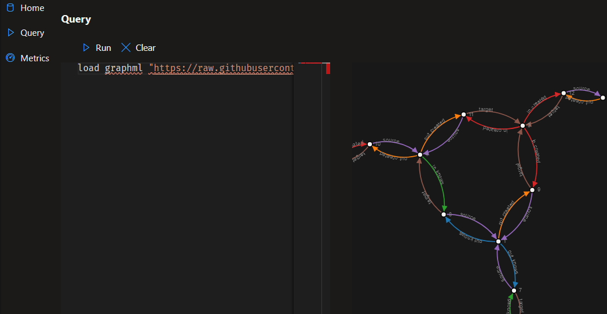
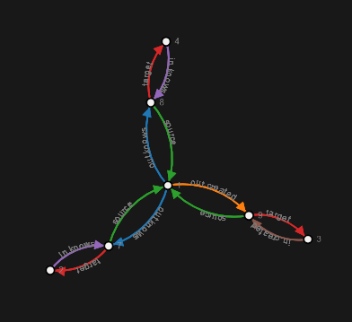
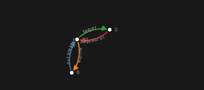
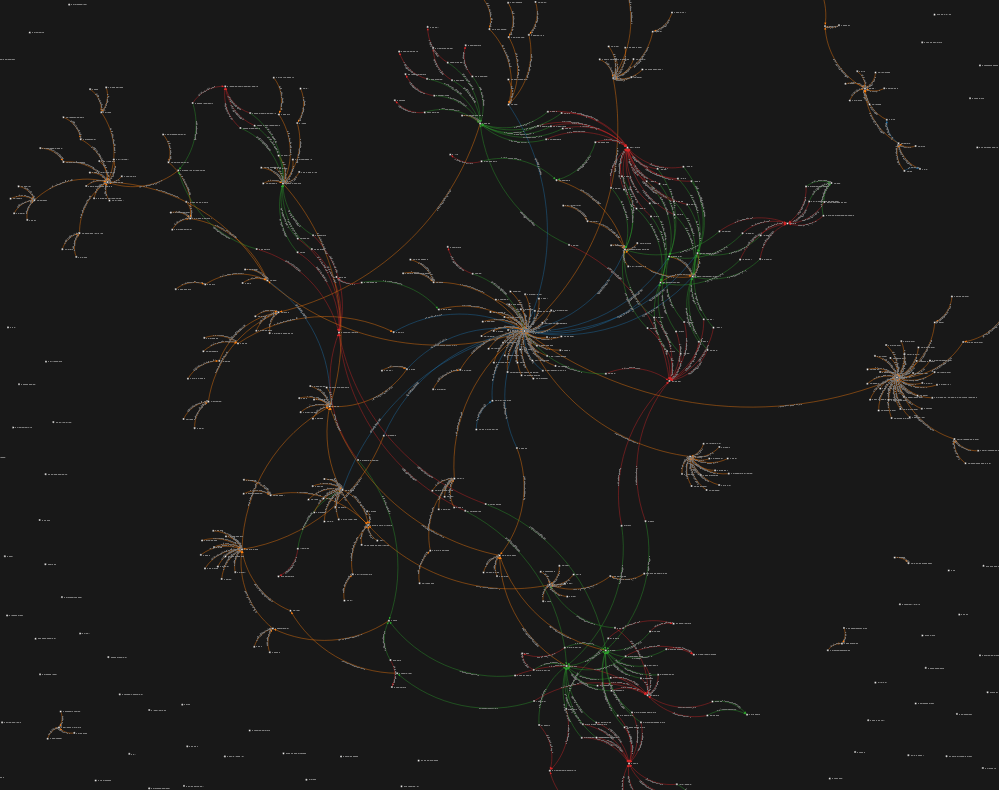
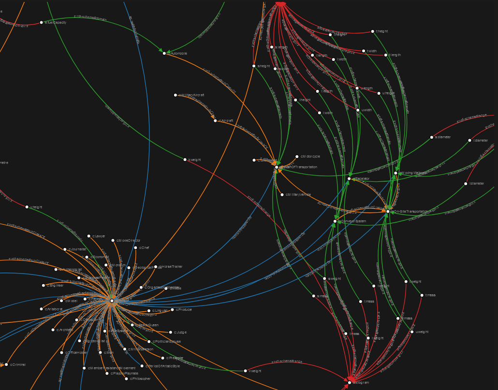

# Ekati - A Database 
## Ekáti (εκάτη / Hecate)


## TLDR

Under development, lot's to do. If your looking for something production ready, this is NOT it. If you want to get your hands into an early open source data project, this could be your thing.

# Interested? 

Do you like graphs or databases, and solving hard problems? Help!

## But what is it really?

It's wanting to be a real graph database, not a virtural graph database. You know the ones that are build on top of document databases, or key value stores, or column stores. Not that those are bad, but I'm hoping there is something better. 

The native data representation is flexable in order to support Neo4j / Gremlin style graphs, as well as semantic graphs, or RDF.

### Some Goals

- Follow edges without using index lookups
- Clustering / Support really really ridiculously large data sets (big-data?)
- Support data-local compute similar to hadoop and friends
- Constant large quantity writes/updates 
    - Max out the network would be ideal. Not even close right now, way too many allocations parsing / loading
- Flexible Indexing
- Property level metadata eg: policy / permission / origin
- Forward references
- Key and Value references
    - `^"friend" : ^"person123"` where ^"friend" referes to the node named "friend", and ^"person123" refers to the node named "person123".
    - `"friend" : ^"person123"` would simply be a property named "friend" that points to the node named "person123"
- Extensible via sandboxed plugins
    - Can we use web assembly for this? What could we use?
    - Value transformation plugins such as
        - encryption / decryption
        - compression
        - text numbers to native
    - Indexing plugins such as
        - full-text 
        - spacial
    - Query operator plugins such as
        - JQ
        - Regex
        - xpath
    - Import / Export plugins
        - CSV
        - Postgres
        - etc
    - API / Protocol plugins
        - JDBC
        - ODBC
        - Python
    - Jobs or stored procedures
        - Run map / reduce 
        - Page rank

## What can it do now?

Right now you can import a few file formats (ttl, graphml) supporting other file types is currently done creating an ANTLR4 grammer, and then add an adapter for that parser to import data.

There is the beginnings of a UI, that runs in your browser. (It's super basic)
    - Note that there is something preventing the connection from working on mac/linux. Plz help. Seems Grpc/HTTP2 related.

There is a very basic query language for testing / development. Higher level language bindings will be possible after more of the low level operators are developed.



# Tech

 - The UI using a webassembly SPA framework called Blazor.
 - The text editor is the same one that is in VS Code.
 - The pretty data graphs are built using D3.js
 - Communication with the database is done over gRPC.

## Database Tech

 - Mostly written in F# and C#. The code is a fair bit ugly, and needs a lot love.
 - It's targeting Linux, OSX, and Windows, using the dotnet core JIT. Currently seeing issues with connecting the UI to the Database on Linux and Mac. Might be HTTP/2 related.
 - Basic nodeId indexing is done using FASTER.
 - The main storage layer has the goal of being a hybrid log structured merge tree. Got a fair bit of work to do there. Maybe we can get FASTER Log to do it for us.
 - There is some thought to sharding support built in, though at this time all the shards run on a single machine, and there has been very little effort done in that area. Clustering is a goal.
 - Query support is ultra basic, and need to do some work in the query language department. Any Ideas?

## Still here?

 - Click *Watch* button
 - Click fork button
 - Jump on Discord https://discord.gg/NfcBmjA

## Can you help?

 Yes!

We need help in all areas.

- Planning
- Architecture
- Documentation
- UI
- Design
- Language
- Low-Level
- Storage
- Testing
- Coding


## Run it

 - Launch the server project
 - Open query tab
 - Add data
```
load graphml "https://raw.githubusercontent.com/Astn/ekati/master/src/core/tinkerpop-modern.xml"
```
or if you can find a ntriples graph
```
load nt "http://path to .NTriples file"
```

view some of it

```
get "1" |> follow * 2
```

```
get "6" |> follow * 2
```

```
get "2", "4"
```

## Enter some data

```
put "your/wonderful/id" 
    "key":"value",
    "key2":"value2",
    "linkname":^"someid",
    "anotherlink":^"anotherid";

    "someid"
        "likes":^"your/wonderful/id",
        "doesnt/like":^"anotherid";

    "anotherid"
        "name":"whatever you like",
        "follows":^"1";    
```

#### get it back out, and then follow any(*) link out 1 jump

```
get "your/wonderful/id", "anotherid" |> follow * 1     
```


## Graphs
#### wikidata's dbo_snapshots.nt limit 1000


zoom in


## Test langauge

Some examples and 
[See Grammar](ekati.lang.rrd.html)

### Put Command

```json
put "me" 
        "type": "person",
        "name": "Austin",
        "fingers": 10,
        "height": 6.42,
        "likes": ^"dogs";
    "dogs"
        "type": "group",
        "member": ^"newfie",
        "member": ^"lab",
        "member": ^"bulldog";
    "newfie"
        "type": "dog",
        "loves": ^"me";
    "lab"
        "type": "dog",
        "likes": ^"me";
    "bulldog"
        "type": "dog",
        "sits on": ^"me";       
```

### Get command

```json
get "*" 
    |> filter "type"="person"
    |> skip 50 
    |> take 10
```

```json
get "me" 
    |> follow * 3
    |> take 100
```

```json
get "me" 
    |> follow "likes" 1
    |> follow "member" 1
    |> filter "type" = "dog"
    |> follow "loves" 1
    |> take 100
```

### Load command

```json
load nt "C:\\Users\\austi\\Downloads\\latest-lexemes.nt"
```

```json
load graphml "https://raw.githubusercontent.com/Astn/ekati/master/src/core/tinkerpop-modern.xml"
```

## Do you like this?

[](https://www.buymeacoffee.com/Ekati)

## Good reading
- [FASTER](https://www.microsoft.com/en-us/research/uploads/prod/2018/03/faster-sigmod18.pdf)
- [BigTable](https://static.googleusercontent.com/media/research.google.com/en//archive/bigtable-osdi06.pdf)
- [DynamoDB](https://www.allthingsdistributed.com/files/amazon-dynamo-sosp2007.pdf)
- [Cassandra](https://www.cs.cornell.edu/projects/ladis2009/papers/lakshman-ladis2009.pdf)
- [Kafka](http://notes.stephenholiday.com/Kafka.pdf)
- [PebblesDb](http://www.cs.utexas.edu/~vijay/papers/sosp17-pebblesdb.pdf)
- [RocksDb](http://cidrdb.org/cidr2017/papers/p82-dong-cidr17.pdf)
- [Lucene](https://pdfs.semanticscholar.org/2795/d9d165607b5ad6d8b9718373b82e55f41606.pdf)
- [Neo4j](https://neo4j.com/whitepapers/graph-algorithms-optimized-neo4j/)
- [YCSB](https://github.com/brianfrankcooper/YCSB/wiki) 
- [SeaStar](http://docs.seastar.io/master/md_doc_tutorial.html)

## Whiteboard

- [Structure Whiteboard](https://miro.com/app/board/o9J_kz6OZhI=/)

